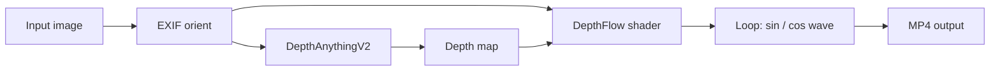

# Parallax Test

Static images → looping 3D parallax videos using [DepthFlow](https://github.com/BrokenSource/DepthFlow).

The script estimates a depth map (DepthAnythingV2), then renders a seamless diagonal camera loop. The first and last frames match the original photo (no zoom/crop at rest).

## Requirements

- macOS / Linux / Windows
- Python 3.10+ (project venv uses 3.12)
- [FFmpeg](https://ffmpeg.org/) on `PATH`
- GPU recommended (Apple Metal / CUDA / etc.)

## Setup

```bash
cd /path/to/parallax_test
uv venv .venv
source .venv/bin/activate          # Windows: .venv\Scripts\activate
uv pip install depthflow
```

Or with pip:

```bash
python -m venv .venv
source .venv/bin/activate
pip install depthflow
```

## Quick start

```bash
source .venv/bin/activate
python render_parallax.py test2.png
python render_parallax.py test_image.jpg -o parallax_output.mp4
```

Default output name: `<input_stem>_parallax.mp4` next to the input file.

Show all options:

```bash
python render_parallax.py --help
```

## CLI parameters

| Parameter | Short | Default | Description |
|-----------|-------|---------|-------------|
| `input` | — | *(required)* | Input image path (`jpg`, `png`, `webp`, …) |
| `--output` | `-o` | `<stem>_parallax.mp4` | Output video path |
| `--time` | `-t` | `4` | One loop duration in seconds (shorter = faster motion) |
| `--fps` | — | `30` | Output frames per second |
| `--model` | — | `large` | DepthAnythingV2 size: `small`, `base`, `large` |
| `--max-side` | — | `1920` | Longest output side in pixels (aspect ratio preserved) |
| `--ssaa` | — | `2` | Supersampling anti-aliasing factor (higher = sharper, slower) |
| `--height` | — | `0.06` | Peak parallax depth / zoom-like push |
| `--isometric` | — | `0.15` | Peak isometric projection strength |
| `--offset` | — | `0.10` | Peak diagonal camera offset |

### Parameter notes

- **`--time`**: Full sine loop length. Example: `-t 3` is faster, `-t 6` is slower.
- **`--model`**: `large` = best quality, slower first run (model download + depth). `small` = fastest.
- **`--max-side`**: Portrait `1080×1920`-class outputs use `1920` on the long side. Landscape scales the same way. Dimensions are forced even for H.264.
- **`--height`**: Controls 3D “push” (zoom-like). Increase carefully (`0.10`–`0.20`); high values cause edge smear.
- **`--offset`**: Diagonal sway amplitude. Higher = more sideways motion; too high → edge artifacts.
- **`--isometric`**: Perspective vs parallel rays. Usually keep near default unless tuning look.
- **EXIF**: Portrait photos with orientation tags are auto-corrected via `ImageOps.exif_transpose`.

## Examples

```bash
# Default settings (large model, 4s loop)
python render_parallax.py photo.png

# Custom output path
python render_parallax.py photo.png -o videos/photo_parallax.mp4

# Faster loop + lighter model
python render_parallax.py photo.png -t 3 --model small

# Stronger parallax (watch for edge smear)
python render_parallax.py photo.png --height 0.10 --offset 0.14

# Milder motion
python render_parallax.py photo.png --height 0.04 --offset 0.06 --isometric 0.10

# Higher resolution / quality
python render_parallax.py photo.png --max-side 2560 --ssaa 2 --model large
```

## Animation behavior



- Motion is a **seamless diagonal loop** over `--time` seconds.
- At loop start/end (`cycle = 0` and `2π`):
  - `zoom = 1.0`
  - `height = 0`
  - `offset = (0, 0)`
  - `isometric = 0`  
  → frame matches the original photo.
- Mid-loop: `height`, `isometric`, and diagonal `offset` peak, then return.

## Project files

| File | Role |
|------|------|
| `render_parallax.py` | CLI renderer |
| `test_image.jpg` | Sample input |
| `test2.png` | Sample input |
| `parallax_output.mp4` | Sample output (from `test_image.jpg`) |
| `parallax_output_test2.mp4` | Sample output (from `test2.png`) |
| `.venv/` | Local Python environment |

## Tips / troubleshooting

1. **Edge smear / stretch** — Lower `--height` and `--offset`, or raise `--max-side` quality with moderate motion.
2. **First run slow** — Depth model downloads and caches; later runs on the same image are faster.
3. **Wrong orientation** — Script applies EXIF transpose; if still wrong, rotate the file manually and re-run.
4. **FFmpeg missing** — Install FFmpeg and ensure it is on `PATH`.
5. **Batch many images** — Call the script per file, e.g.:

```bash
for f in *.jpg *.png; do
  python render_parallax.py "$f" -o "out/${f%.*}_parallax.mp4"
done
```

## Stack

- [DepthFlow](https://github.com/BrokenSource/DepthFlow) `1.0.0`
- DepthAnythingV2 (`small` / `base` / `large`)
- FFmpeg (H.264 export)
- Pillow (EXIF-aware load)
